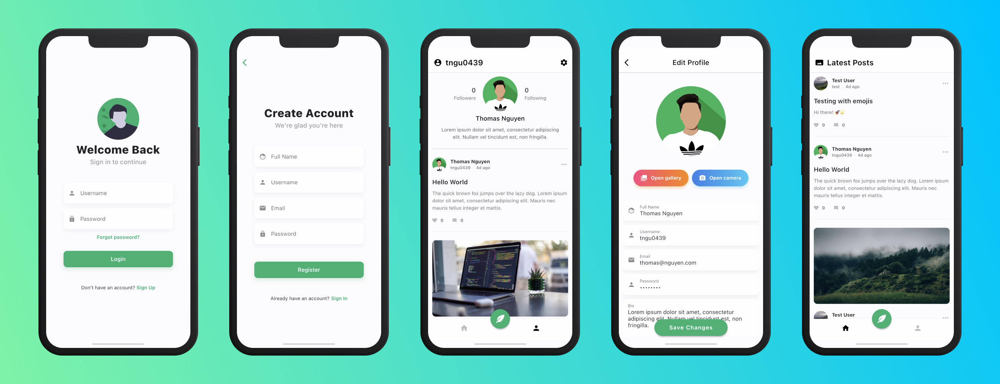

<div align="center">

    <h1>
        Social Media App
    </h1>
    <p>
        This repo contains the full source code for a social media app built with Flutter. It was created as a final end of year project for my 3rd year computer science course in high school. Watch the full video demo <a href="https://i.imgur.com/bjysB2E.mp4">here</a>!
    </p>
</div>

## Technologies

* **Flutter** + **Dart** was used to create the mobile app.
* **Python** + **Flask** was used to allow the app to communicate with the database and Imgur's API.
* **MongoDB** was the database of choice for this project.
* **AWS** + **Linux** was used to host the Flask API.

## Screenshots



## API Endpoints

A custom-built Flask API was created as bridge for the app to interact with the database. Below is a list of all of the endpoints along with their query parameters if applicable:

```
DELETE    /posts?post_id=0
PATCH     /posts?post=post
POST      /posts
GET       /posts
GET       /posts?author_id=0

PATCH     /users
POST      /users
GET       /users
GET       /users?username=username
```

**Note**: The API will ignore any requests that do not include the `Authorization` header. Unlike other common APIs, the `Authorization` header doesn't need to start with `Bearer: `. It may include any string as long as it matches the value of `AUTHORIZATION` in the `.env` file inside of the `src/python/src` directory.